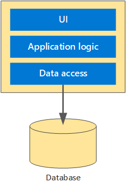
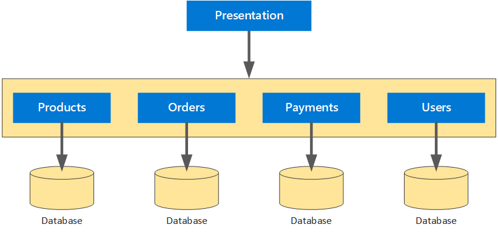
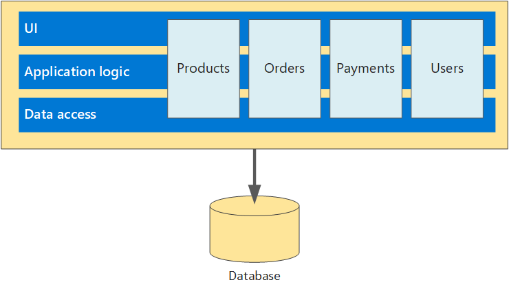
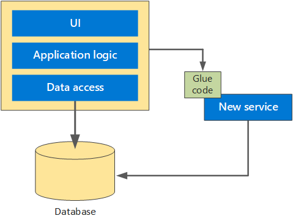
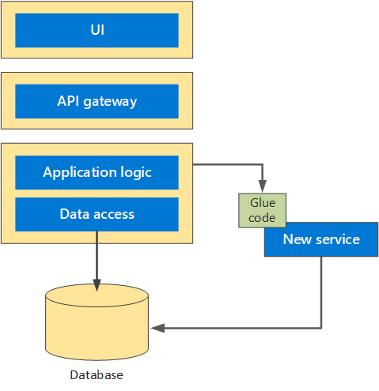
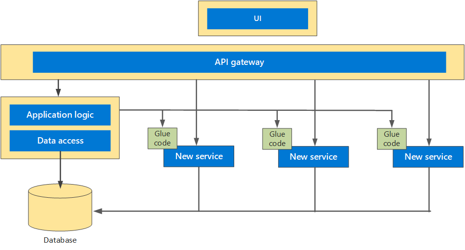

# Monolith to Microservices migration

## Methodology

### Monoliths to microservices using domain-driven design

Ref. Strangler Fig pattern by Martin Fowler

[See Microsoft Documentation](https://docs.microsoft.com/en-us/azure/architecture/microservices/migrate-monolith)

Objectives:

To help facilitate the decomposition modules from Monolith to Microservices, a viable software development approach is to apply the principles of domain-driven design (DDD).

Monolith

Microservices

### Migration Strategy

1. Planning, Decompose modules and models with DDD

    1. Start with a *ubiquitous language*, a common vocabulary that is shared between all stakeholders.

    1. Identify the relevant modules in the monolithic application and apply the common vocabulary to them.

    1. Define the domain models of the monolithic application. The domain model is an abstract model of the business domain.

    1. Define *bounded contexts* for the models. A bounded context is the boundary within a domain where a particular domain model applies. Apply explicit boundaries with clearly defined models and responsibilities.

    
    \
    &nbsp;
1. Develop glue code (anti-corruption layer)

1. Separate the presentation/UI layer from the backend layer

    1. UI Layer, Refactoring with API Gateway
    1. Business Layer, Develop Services base on No.1
    1. Data Layer, Data Modeling & Migration
1. Testing
1. Deployment
1. Start to retire the monolith

1. Post Implementation Support

## Implementation

### Current System

### 1. Planning, Decompose modules and models with DDD

#### Security Layer

#### Access Layer

#### Services Layer

Decompose modules into 3 namespace: ERP, Logistics and E-Commerce

#### Data Layer

#### Diagram